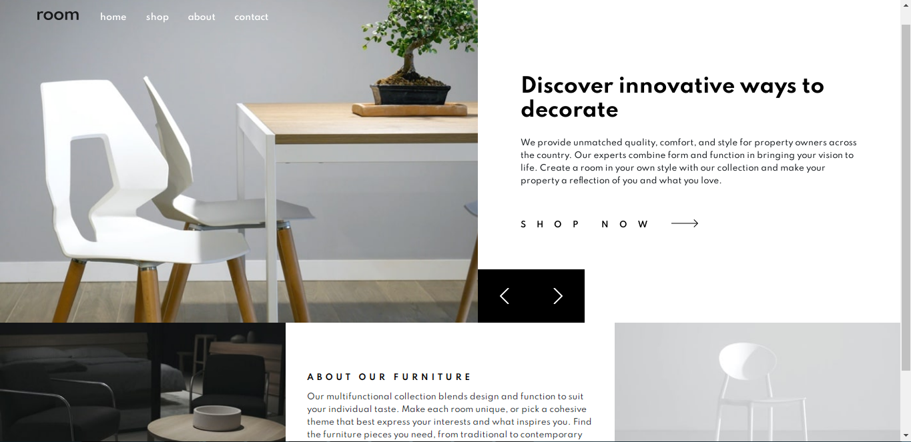
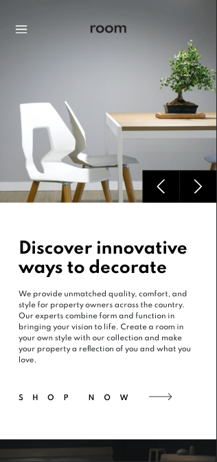
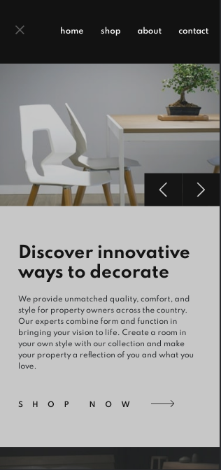

# Room_Homepage
This is a solution to the [Room Homepage challenge on Frontend Mentor](https://www.frontendmentor.io/challenges/room-homepage-BtdBY_ENq)

## Overview

Users should be able to:
  - View the optimal layout for the site depending on their device's screen size
  - see hover states for all interactive elements on the page
  - Navigate the slider using either mouse/trackpad or keyboard

### Screenshots

 

### Built with
- HTML5, CSS, Javascript
- Flexbox
- CSS Grid
- [SequenceJS](https://sequencejs.com)

### Useful resources
- [CSS-Tricks](https//css-tricks.com) - This helped me with configuring animations for the header in mobile mode
- [Connor Z. solution](https://zzl-frontendmentor-challenges.vercel.app/room-homepage-master/) | [Connor Z. github](https://github.com/zuolizhu/frontendmentor_challenges) - This helped give a reference of how I should style the page in terms of sizing. Especially helped solving the hover state on the navigation menu

